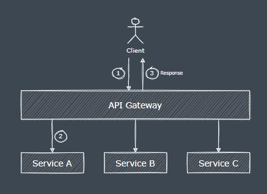
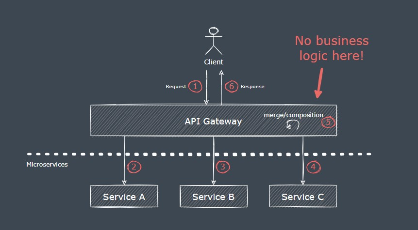
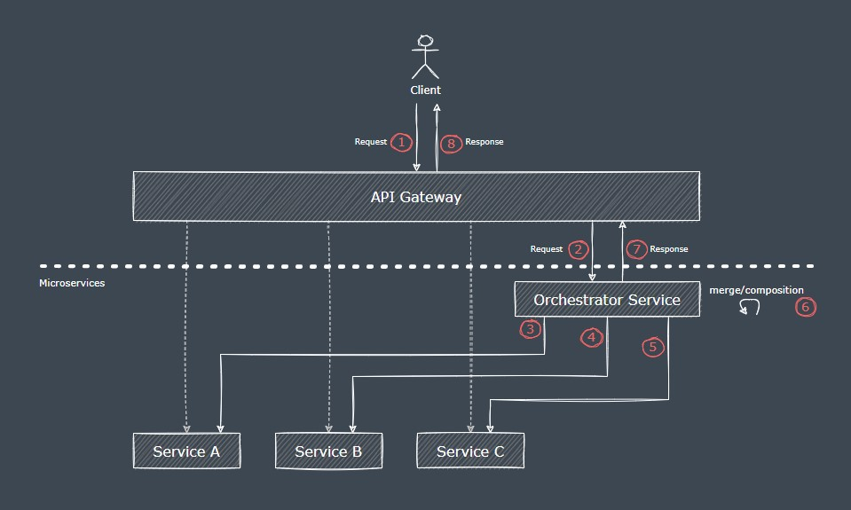

# The context
We have a system based on microservices, where the codebase has been split into smaller pieces, and every component has a few responsibilities.
In order to limit the discussion and keep the debate on this subject, let's consider a group of read-only APIs.

In this scenario, it's quite obvious that it's a good choice to use an API Gateway. This intermediation, intended as a proxy (or more properly a reverse proxy), has many advantages, mostly related to security and observability:
- The coupling between the client and the underlying service implementation is highly reduced
- Multiple types of protocols can be handled
- The disclosure of internal concerns is avoided
- It's a good place to introduce canary and blue-green deployments
- It can be used to handle multiple versions of the APIs
- It can collect usage metrics and generate correlation ids
- It can provide an external cache and apply rate-limiting

# The problem
After having implemented the API Gateway as a simple routing layer, sooner or later we will deal with the need to call **more than one service** to satisfy a request: we may perhaps need to *merge* data that comes from multiple microservices, or we may need to call a service and then use its response to perform requests to other services, doing what is usually called API *composition*.

The API Gateway might seem a reasonable place to perform aggregation of data coming from multiple services or to make a call chain that collects all the data needed to produce the response.

Well, in my opinion it's not really a good idea to put business logic in a component that should just be considered part of the infrastructure, inside an area that in some companies goes far beyond the responsibility of the development team.

Even worst, after the introduction of multiple aggregations or compositions, we could end up with a spaghetti mix of business logic coming from different domains: an awful mess.

A little different flavor of this anti-pattern, with a focus on cloud providers' managed API Gateway services, has been sometime called [Overambitious API Gateway](https://www.thoughtworks.com/radar/platforms/overambitious-api-gateways){:target="_blank"} but I personally think that this name is fitting very well here too.

# The "Orchestrator pattern" solution (aka Aggregator)

The idea, which is pretty straightforward, is to introduce a service with the clear and declared responsibility of making multiple calls to the underlying services, collecting and/or accumulating data, performing data transformations, aggregations, and finally responding to the initiating request.

With this strategy, the business logic is implemented *in the code* and not *in the infrastructure* (and no, "Infrastructure as code" is not a win-win option here). 😜

It is possible to create multiple orchestrators, to handle requests in an orderly fashion, for different callers or within different domains, each one with different and independent contracts.

Compared with other patterns like the "Chained microservice pattern", an orchestrator can speed up the time to market because it will likely need a fewer number of tests. Also, it is a good example of the [DRY](https://en.wikipedia.org/wiki/Don%27t_repeat_yourself){:target="_blank"} principle, and lowers the risk of unexpected breaking changes, with the additional advantage of keeping the microservice lean, clean, and essential.

# Is everything clear? Uh, no.

I called this pattern both "*Orchestrator*" and "*Aggregator*": good but not great.

The reason behind this confusion is that this pattern 50% of the time is called [Orchestration pattern](https://www.techtarget.com/searchapparchitecture/tip/Learn-the-benefits-of-microservices-orchestration){:target="_blank"} and the other 50% is called [Service aggregation pattern](https://medium.com/design-microservices-architecture-with-patterns/service-aggregator-pattern-e87561a47ac6){:target="_blank"}, but don't confuse it with the [Gateway aggregation pattern](https://medium.com/design-microservices-architecture-with-patterns/gateway-aggregation-pattern-9ff92e1771d0){:target="_blank"}, which is exactly what I have just considered an anti-pattern, a few lines above.

The wonderful world of microservices architecture is full of multiple names for the same thing, while different things are sometimes called using the same name.

This pattern is sometimes (e.g. by Microsoft) considered "the problem" and the solution proposed is the [Choreography pattern](https://docs.microsoft.com/en-us/azure/architecture/patterns/choreography){:target="_blank"}. I personally don't agree with this idea, because I see the two options as alternatives, with pros ad cons to be evaluated from time to time.

Last but not least, Microsoft itself calls the pattern [Gateway aggregation](https://docs.microsoft.com/en-us/azure/architecture/patterns/gateway-aggregation){:target="_blank"} with this recommendation: "Instead of building aggregations into the gateway, consider placing an aggregation service behind the gateway". Oh, gosh, so the idea is to implement a *gateway aggregation* with the aggregation process itself *outside* the gateway.  
I agree, but I got a headache.

# TLDR
Don't waste your time on pattern names and definitions, but focus on the core concept of **orchestrator/aggregator**: a service that calls other services to keep the business logic tidy.
